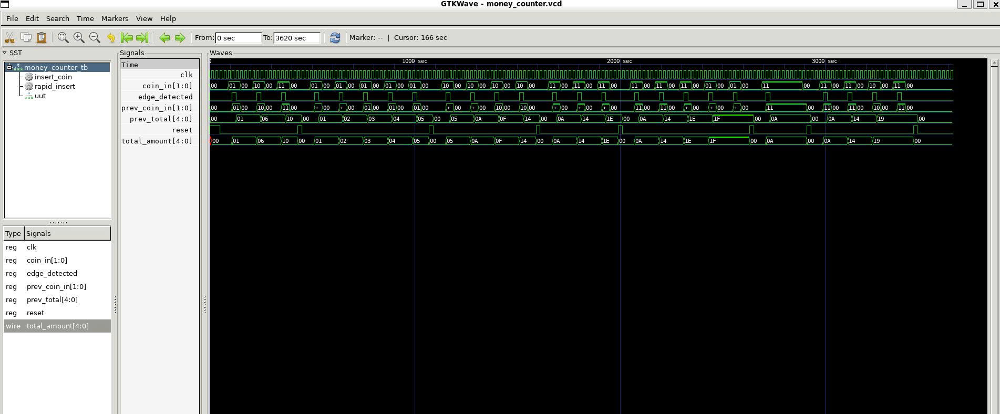

# Dự án Máy bán hàng tự động (Vending Machine)

## Mô tả dự án
Thiết kế một máy bán hàng tự động sử ngôn ngữ Verilog, mô phỏng hoạt động của máy bán hàng thực tế với các chức năng nhận tiền, chọn sản phẩm và trả lại tiền thừa.

## Đặc tả thiết kế:
- Tần số đồng hồ: 50MHz
- Hỗ trợ 3 loại sản phẩm: A (giá 15₫), B (giá 20₫), C (giá 25₫)
- Hỗ trợ 3 loại tiền xu: 1₫, 5₫, 10₫
- Thời gian chờ để chọn sản phẩm: 30 giây
- Thời gian trả sản phẩm: 5 giây
- Thời gian trả tiền thừa: 5 giây
- Điều khiển hiển thị LED 7 đoạn (2 chữ số)

## Yêu cầu chức năng
1. Nhận tiền đầu vào (các mệnh giá khác nhau)
2. Hiển thị số tiền đã nhận
3. Cho phép người dùng chọn sản phẩm
4. Kiểm tra xem số tiền đã đủ cho sản phẩm được chọn chưa
5. Trả sản phẩm và tiền thừa (nếu có)
6. Hiển thị trạng thái của máy

## Thiết kế hệ thống

### Đặc tả đầu vào - đầu ra
| Port | Bus size | Direction | Description |
|:----:|:--------:|:---------:|:------------|
| clk | 1 | input | Tín hiệu đồng hồ hệ thống |
| reset | 1 | input | Tín hiệu reset đồng bộ, active-high |
| coin_in | 2 | input | : 00: không có, 01: 1₫, 10: 5₫, 11: 10₫ |
| product_sel | 2 | input | Sản phẩm được chọn: 00: không chọn, 01: sản phẩm A (15₫), 10: sản phẩm B (20₫), 11: sản phẩm C (25₫) |
| cancel | 1 | input | Tín hiệu hủy giao dịch |
| current_amount_display | 5 | output | Hiển thị số tiền hiện có (0-31₫) |
| product_out | 2 | output | Sản phẩm được xuất: 01: sản phẩm A, 10: sản phẩm B, 11: sản phẩm C |
| change_out | 5 | output | Số tiền thối lại (0-31₫) |
| state_out | 3 | output | Trạng thái hiện tại của máy bán hàng |
| amount_display | 8 | output | Tín hiệu điều khiển đèn LED 7 đoạn hiển thị số tiền |
| status_display | 8 | output | Tín hiệu điều khiển đèn LED 7 đoạn hiển thị trạng thái |
| led_indicators | 4 | output | Đèn LED chỉ thị trạng thái máy |

### Các module chính
1. **Controller Module**: Điều khiển luồng hoạt động của máy
2. **Money Counter Module**: Đếm và tính toán số tiền được nhập vào
3. **Product Selection Module**: Xử lý việc chọn sản phẩm
4. **Display Module**: Hiển thị thông tin cho người dùng
5. **Change Calculator Module**: Tính toán tiền thừa cần trả lại


### Máy trạng thái (FSM)
```
IDLE → MONEY_DEPOSIT → PRODUCT_SELECT → [không đủ tiền → MONEY_DEPOSIT]
                                       → [đủ tiền → DISPENSE_PRODUCT → RETURN_CHANGE → IDLE]
                                       → [cancel → RETURN_CHANGE → IDLE]
```

### Đặc tả và kết nối của các module

#### 1. Money Counter Module
| Port | Bus size | Direction | Kết nối |
|:----:|:--------:|:---------:|:--------|
| clk | 1 | input | Từ hệ thống |
| reset | 1 | input | Từ hệ thống (kết hợp với reset_money từ FSM) |
| coin_in | 2 | input | Từ người dùng |
| total_amount | 5 | output | → FSM Controller (current_amount)<br>→ Display Module (current_amount)<br>→ Change Calculator (current_amount)<br>→ Đầu ra hệ thống (current_amount_display) |

#### 2. Product Selection Module
| Port | Bus size | Direction | Kết nối |
|:----:|:--------:|:---------:|:--------|
| clk | 1 | input | Từ hệ thống |
| reset | 1 | input | Từ hệ thống |
| product_sel | 2 | input | Từ người dùng |
| selected_price | 5 | output | → FSM Controller (selected_price)<br>→ Change Calculator (product_price) |

#### 3. FSM Controller Module
| Port | Bus size | Direction | Kết nối |
|:----:|:--------:|:---------:|:--------|
| clk | 1 | input | Từ hệ thống |
| reset | 1 | input | Từ hệ thống |
| coin_in | 2 | input | Từ người dùng |
| product_sel | 2 | input | Từ người dùng |
| cancel | 1 | input | Từ người dùng |
| current_amount | 5 | input | Từ Money Counter (total_amount) |
| selected_price | 5 | input | Từ Product Selection |
| valid_transaction | 1 | input | Từ Change Calculator |
| current_state | 3 | output | → Display Module<br>→ Đầu ra hệ thống (state_out) |
| dispense_command | 1 | output | Tín hiệu điều khiển nội bộ |
| calculate_change | 1 | output | → Change Calculator (calculate) |
| reset_money | 1 | output | → Money Counter (reset) |
| product_out | 2 | output | → Display Module<br>→ Đầu ra hệ thống |

#### 4. Change Calculator Module
| Port | Bus size | Direction | Kết nối |
|:----:|:--------:|:---------:|:--------|
| clk | 1 | input | Từ hệ thống |
| reset | 1 | input | Từ hệ thống |
| current_amount | 5 | input | Từ Money Counter (total_amount) |
| product_price | 5 | input | Từ Product Selection (selected_price) |
| calculate | 1 | input | Từ FSM Controller (calculate_change) |
| change_amount | 5 | output | → Display Module (change_out)<br>→ Đầu ra hệ thống (change_out) |
| valid_transaction | 1 | output | → FSM Controller |

#### 5. Display Module
| Port | Bus size | Direction | Kết nối |
|:----:|:--------:|:---------:|:--------|
| clk | 1 | input | Từ hệ thống |
| reset | 1 | input | Từ hệ thống |
| current_amount | 5 | input | Từ Money Counter (total_amount) |
| current_state | 3 | input | Từ FSM Controller |
| product_out | 2 | input | Từ FSM Controller |
| change_out | 5 | input | Từ Change Calculator (change_amount) |
| amount_display | 8 | output | → Đầu ra hệ thống |
| status_display | 8 | output | → Đầu ra hệ thống |
| led_indicators | 4 | output | → Đầu ra hệ thống |

## Cấu Trúc Thư Mục

```
Vending_machine_verilog/
├── README.md                     
├── Vending_Machine.md           
├── Money_counter/
│   ├── Money_counter.v           
│   └── Money_counter_tb.v       
├── Product_selection/
│   ├── Product_selection.v       
│   └── Product_selection_tb.v    
├── FSM_controller/
│   ├── FSM_controller.v         
│   └── FSM_controller_tb.v      
├── Change_calculator/
│   ├── change_calculator.v       
│   └── Change_calculator_tb.v    
└── Vending_machine/
    ├── Vending_machine.v         
    ├── Vending_machine_tb.v      
    ├── Money_counter.v          
    ├── Product_selection.v       
    ├── FSM_controller.v          
    └── change_calculator.v       
```
### Sơ đồ kết nối tổng thể của hệ thống
## Các module con chi tiết

Để verify chức năng của từng thành phần, dưới đây là triển khai các module con riêng biệt:

### 1. Money Counter Module


```verilog
module money_counter (
    input wire clk,
    input wire reset,
    input wire [1:0] coin_in,    // 00: no coin, 01: 1₫, 10: 5₫, 11: 10₫
    output reg [4:0] total_amount
);
    // Định nghĩa giá trị tiền
    parameter COIN_1 = 5'd1;
    parameter COIN_5 = 5'd5;
    parameter COIN_10 = 5'd10;
    
    always @(posedge clk or posedge reset) begin
        if (reset) begin
            total_amount <= 5'd0;
        end
        else begin
            case (coin_in)
                2'b01: total_amount <= total_amount + COIN_1;
                2'b10: total_amount <= total_amount + COIN_5;
                2'b11: total_amount <= total_amount + COIN_10;
                default: total_amount <= total_amount;
            endcase
        end
    end
endmodule
```

#### Kết quả mô phỏng Money Counter Module:



### 2. Product Selection Module


```verilog
module product_selection (
    input wire clk,
    input wire reset,
    input wire [1:0] product_sel,  // 00: no selection, 01: product A, 10: product B, 11: product C
    output reg [4:0] selected_price
);
    // Định nghĩa giá sản phẩm
    parameter PRODUCT_A_PRICE = 5'd15;
    parameter PRODUCT_B_PRICE = 5'd20;
    parameter PRODUCT_C_PRICE = 5'd25;
    
    always @(posedge clk or posedge reset) begin
        if (reset) begin
            selected_price <= 5'd0;
        end
        else begin
            case (product_sel)
                2'b01: selected_price <= PRODUCT_A_PRICE;
                2'b10: selected_price <= PRODUCT_B_PRICE;
                2'b11: selected_price <= PRODUCT_C_PRICE;
                default: selected_price <= selected_price; // Giữ nguyên giá trị
            endcase
        end
    end
endmodule
```

#### Kết quả mô phỏng Product Selection Module:


### 3. Display Module


```verilog
module display_module (
    input wire clk,
    input wire reset,
    input wire [4:0] current_amount,
    input wire [2:0] current_state,
    input wire [1:0] product_out,
    input wire [4:0] change_out,
    
    output reg [7:0] amount_display,    // 7-đoạn cho số tiền hiện tại
    output reg [7:0] status_display,    // 7-đoạn cho trạng thái
    output reg [3:0] led_indicators     // LED chỉ thị trạng thái
);
    // Định nghĩa các trạng thái
    parameter IDLE = 3'b000;
    parameter MONEY_DEPOSIT = 3'b001;
    parameter PRODUCT_SELECT = 3'b010;
    parameter DISPENSE_PRODUCT = 3'b011;
    parameter RETURN_CHANGE = 3'b100;
    
    // Mã 7-đoạn cho các số từ 0-9 (thực tế)
    // Format: MSB=A, LSB=DP (abcdefgp)
    parameter [7:0] DIGIT_0 = 8'b11111100; // 0: abcdef--
    parameter [7:0] DIGIT_1 = 8'b01100000; // 1: -bc----
    parameter [7:0] DIGIT_2 = 8'b11011010; // 2: ab-de-g-
    parameter [7:0] DIGIT_3 = 8'b11110010; // 3: abcd--g-
    parameter [7:0] DIGIT_4 = 8'b01100110; // 4: -bc--fg-
    parameter [7:0] DIGIT_5 = 8'b10110110; // 5: a-cd-fg-
    parameter [7:0] DIGIT_6 = 8'b10111110; // 6: a-cdefg-
    parameter [7:0] DIGIT_7 = 8'b11100000; // 7: abc-----
    parameter [7:0] DIGIT_8 = 8'b11111110; // 8: abcdefg-
    parameter [7:0] DIGIT_9 = 8'b11110110; // 9: abcd-fg-
    
    // Chuyển đổi số thành hiển thị 7-đoạn
    function [7:0] bcd_to_7seg;
        input [3:0] bcd;
        begin
            case (bcd)
                4'd0: bcd_to_7seg = DIGIT_0;
                4'd1: bcd_to_7seg = DIGIT_1;
                4'd2: bcd_to_7seg = DIGIT_2;
                4'd3: bcd_to_7seg = DIGIT_3;
                4'd4: bcd_to_7seg = DIGIT_4;
                4'd5: bcd_to_7seg = DIGIT_5;
                4'd6: bcd_to_7seg = DIGIT_6;
                4'd7: bcd_to_7seg = DIGIT_7;
                4'd8: bcd_to_7seg = DIGIT_8;
                4'd9: bcd_to_7seg = DIGIT_9;
                default: bcd_to_7seg = 8'h00;
            endcase
        end
    endfunction
    
    always @(posedge clk or posedge reset) begin
        if (reset) begin
            amount_display <= DIGIT_0;
            status_display <= DIGIT_0;
            led_indicators <= 4'b0000;
        end
        else begin
            // Hiển thị số tiền (chuyển đổi số tiền sang 7-đoạn)
            // Đơn giản hóa: chỉ hiển thị đơn vị
            amount_display <= bcd_to_7seg(current_amount[3:0]);
            
            // Hiển thị trạng thái
            case (current_state)
                IDLE: begin
                    status_display <= DIGIT_0;
                    led_indicators <= 4'b0001;
                end
                MONEY_DEPOSIT: begin
                    status_display <= DIGIT_1;
                    led_indicators <= 4'b0010;
                end
                PRODUCT_SELECT: begin
                    status_display <= DIGIT_2;
                    led_indicators <= 4'b0100;
                end
                DISPENSE_PRODUCT: begin
                    status_display <= DIGIT_3;
                    led_indicators <= 4'b1000;
                end
                RETURN_CHANGE: begin
                    status_display <= DIGIT_4;
                    led_indicators <= 4'b1100;
                end
                default: begin
                    status_display <= DIGIT_0;
                    led_indicators <= 4'b0000;
                end
            endcase
        end
    end
endmodule
```

### 4. Change Calculator Module


```verilog
module change_calculator (
    input wire clk,
    input wire reset,
    input wire [4:0] current_amount,
    input wire [4:0] product_price,
    input wire calculate,
    
    output reg [4:0] change_amount,
    output reg valid_transaction
);
    
    always @(posedge clk or posedge reset) begin
        if (reset) begin
            change_amount <= 5'd0;
            valid_transaction <= 1'b0;
        end
        else if (calculate) begin
            if (current_amount >= product_price) begin
                // Đủ tiền để mua sản phẩm
                change_amount <= current_amount - product_price;
                valid_transaction <= 1'b1;
            end
            else begin
                // Không đủ tiền - trả lại toàn bộ
                change_amount <= current_amount;
                valid_transaction <= 1'b0;
            end
        end
        else begin
            // Giữ nguyên giá trị khi không có lệnh tính toán
            change_amount <= change_amount;
            valid_transaction <= valid_transaction;
        end
    end
endmodule
```

#### Kết quả mô phỏng Change Calculator Module:


### 5. FSM Controller Module


```verilog
module fsm_controller (
    input wire clk,
    input wire reset,
    input wire [1:0] coin_in,
    input wire [1:0] product_sel,
    input wire cancel,
    input wire [4:0] current_amount,
    input wire [4:0] selected_price,
    input wire valid_transaction,
    
    output reg [2:0] current_state,
    output reg dispense_command,
    output reg calculate_change,
    output reg reset_money,
    output reg [1:0] product_out
);
    // Định nghĩa các trạng thái
    parameter IDLE = 3'b000;
    parameter MONEY_DEPOSIT = 3'b001;
    parameter PRODUCT_SELECT = 3'b010;
    parameter DISPENSE_PRODUCT = 3'b011;
    parameter RETURN_CHANGE = 3'b100;
    
    // Bộ đếm thời gian (có thể triển khai đầy đủ trong thiết kế thực tế)
    reg [4:0] timeout_counter;
    wire timeout = (timeout_counter == 5'd0);
    
    reg [2:0] next_state;
    
    // Cập nhật bộ đếm thời gian
    always @(posedge clk or posedge reset) begin
        if (reset) begin
            timeout_counter <= 5'd30; // 30 giây mặc định
        end
        else begin
            if (current_state == MONEY_DEPOSIT || current_state == PRODUCT_SELECT) begin
                if (timeout_counter > 0)
                    timeout_counter <= timeout_counter - 1;
            end
            else begin
                timeout_counter <= 5'd30; // Reset bộ đếm ở các trạng thái khác
            end
        end
    end
    
    // Khối xử lý trạng thái hiện tại
    always @(posedge clk or posedge reset) begin
        if (reset)
            current_state <= IDLE;
        else
            current_state <= next_state;
    end
    
    // Khối xử lý trạng thái tiếp theo
    always @(*) begin
        case (current_state)
            IDLE: begin
                if (coin_in != 2'b00)
                    next_state = MONEY_DEPOSIT;
                else
                    next_state = IDLE;
            end
            
            MONEY_DEPOSIT: begin
                if (cancel || timeout)
                    next_state = RETURN_CHANGE;
                else if (product_sel != 2'b00)
                    next_state = PRODUCT_SELECT;
                else
                    next_state = MONEY_DEPOSIT;
            end
            
            PRODUCT_SELECT: begin
                if (cancel || timeout)
                    next_state = RETURN_CHANGE;
                else if (current_amount >= selected_price)
                    next_state = DISPENSE_PRODUCT;
                else if (coin_in != 2'b00)
                    next_state = MONEY_DEPOSIT; // Quay lại nhập thêm tiền
                else
                    next_state = PRODUCT_SELECT;
            end
            
            DISPENSE_PRODUCT: begin
                next_state = RETURN_CHANGE;
            end
            
            RETURN_CHANGE: begin
                next_state = IDLE;
            end
            
            default: next_state = IDLE;
        endcase
    end
    
    // Khối xử lý đầu ra
    always @(posedge clk or posedge reset) begin
        if (reset) begin
            dispense_command <= 1'b0;
            calculate_change <= 1'b0;
            reset_money <= 1'b0;
            product_out <= 2'b00;
        end
        else begin
            // Mặc định giá trị
            dispense_command <= 1'b0;
            calculate_change <= 1'b0;
            reset_money <= 1'b0;
            
            case (current_state)
                IDLE: begin
                    reset_money <= 1'b1; // Reset bộ đếm tiền khi ở trạng thái IDLE
                    product_out <= 2'b00; // Không có sản phẩm
                end
                
                PRODUCT_SELECT: begin
                    if (current_amount >= selected_price && product_sel != 2'b00)
                        product_out <= product_sel; // Lưu sản phẩm được chọn
                end
                
                DISPENSE_PRODUCT: begin
                    dispense_command <= 1'b1; // Kích hoạt lệnh xuất sản phẩm
                end
                
                RETURN_CHANGE: begin
                    calculate_change <= 1'b1; // Kích hoạt tính toán tiền thừa
                end
                
                default: begin
                    // Giữ nguyên các giá trị
                end
            endcase
        end
    end
endmodule
```

#### Kết quả mô phỏng FSM Controller Module:


### Kết hợp các module để tạo hệ thống hoàn chỉnh


```verilog
module Vending_machine (
    // Đầu vào hệ thống
    input wire clk,                    // Đồng hồ hệ thống
    input wire reset,                  // Reset đồng bộ
    input wire [1:0] coin_in,          // Loại tiền xu nhập vào
    input wire [1:0] product_sel,      // Sản phẩm được chọn
    input wire cancel,                 // Tín hiệu hủy giao dịch
    
    // Đầu ra hệ thống
    output wire [4:0] current_amount_display, // Hiển thị số tiền hiện có
    output wire [1:0] product_out,     // Sản phẩm được xuất
    output wire [4:0] change_out,      // Số tiền thối lại
    output wire [2:0] state_out,       // Trạng thái máy
    output wire [7:0] amount_display,  // LED 7 đoạn hiển thị số tiền
    output wire [7:0] status_display,  // LED 7 đoạn hiển thị trạng thái
    output wire [3:0] led_indicators   // LED chỉ thị trạng thái
);
    // Dây nội bộ
    wire [4:0] current_amount;         // Tổng số tiền từ Money Counter
    wire [4:0] selected_price;         // Giá sản phẩm từ Product Selection
    wire dispense_command;             // Lệnh xuất sản phẩm
    wire calculate_change;             // Lệnh tính toán tiền thừa
    wire reset_money;                  // Lệnh reset bộ đếm tiền
    wire valid_transaction;            // Tín hiệu giao dịch hợp lệ

    // Khởi tạo các module
    money_counter money_counter_inst (
        .clk(clk),                        // Từ hệ thống
        .reset(reset | reset_money),      // Từ hệ thống và FSM Controller
        .coin_in(coin_in),                // Từ đầu vào hệ thống
        .total_amount(current_amount)     // Kết nối nội bộ đến các module khác
    );
    
    product_selection product_selection_inst (
        .clk(clk),                        // Từ hệ thống
        .reset(reset),                    // Từ hệ thống
        .product_sel(product_sel),        // Từ đầu vào hệ thống
        .selected_price(selected_price)   // Kết nối nội bộ đến các module khác
    );
    
    fsm_controller fsm_controller_inst (
        .clk(clk),                        // Từ hệ thống
        .reset(reset),                    // Từ hệ thống
        .coin_in(coin_in),                // Từ đầu vào hệ thống
        .product_sel(product_sel),        // Từ đầu vào hệ thống
        .cancel(cancel),                  // Từ đầu vào hệ thống
        .current_amount(current_amount),  // Từ Money Counter
        .selected_price(selected_price),  // Từ Product Selection
        .valid_transaction(valid_transaction), // Từ Change Calculator
        .current_state(state_out),        // Đến Display Module và đầu ra hệ thống
        .dispense_command(dispense_command), // Tín hiệu điều khiển nội bộ
        .calculate_change(calculate_change), // Đến Change Calculator
        .reset_money(reset_money),        // Đến Money Counter
        .product_out(product_out)         // Đến Display Module và đầu ra hệ thống
    );
    
    change_calculator change_calculator_inst (
        .clk(clk),                        // Từ hệ thống
        .reset(reset),                    // Từ hệ thống
        .current_amount(current_amount),  // Từ Money Counter
        .product_price(selected_price),   // Từ Product Selection
        .calculate(calculate_change),     // Từ FSM Controller
        .change_amount(change_out),       // Đến Display Module và đầu ra hệ thống
        .valid_transaction(valid_transaction) // Đến FSM Controller
    );
    
    display_module display_module_inst (
        .clk(clk),                        // Từ hệ thống
        .reset(reset),                    // Từ hệ thống
        .current_amount(current_amount),  // Từ Money Counter
        .current_state(state_out),        // Từ FSM Controller
        .product_out(product_out),        // Từ FSM Controller
        .change_out(change_out),          // Từ Change Calculator
        .amount_display(amount_display),  // Đầu ra hệ thống
        .status_display(status_display),  // Đầu ra hệ thống
        .led_indicators(led_indicators)   // Đầu ra hệ thống
    );
    
    // Kết nối đầu ra hệ thống
    assign current_amount_display = current_amount;
endmodule
```

#### Kết quả mô phỏng hệ thống tổng thể:


## Hướng dẫn chạy mô phỏng và waveform

### Yêu cầu hệ thống
- **Icarus Verilog (iverilog)**: Trình biên dịch và mô phỏng Verilog
- **GTKWave**: Trình xem waveform
- **Terminal/Command Prompt**: Để chạy các lệnh

### Cài đặt công cụ (Ubuntu/WSL)
```bash
# Cài đặt Icarus Verilog
sudo apt update
sudo apt install iverilog

# Cài đặt GTKWave
sudo apt install gtkwave

# Kiểm tra cài đặt
iverilog -V
gtkwave --version
```

### 1. Mô phỏng Money Counter Module

#### Bước 1: Di chuyển đến thư mục Money Counter
```bash
cd Money_counter/
```

#### Bước 2: Biên dịch và chạy mô phỏng
```bash
# Biên dịch module và testbench
iverilog -o money_counter_sim Money_counter.v Money_counter_tb.v

# Chạy mô phỏng
vvp money_counter_sim

# Kết quả sẽ hiển thị trên terminal và tạo file .vcd
```

#### Bước 3: Xem waveform
```bash
# Mở GTKWave với file waveform được tạo
gtkwave money_counter.vcd

# Hoặc nếu file có tên khác
gtkwave *.vcd
```

#### Các tín hiệu quan trọng để quan sát:
- `clk`: Tín hiệu đồng hồ
- `reset`: Tín hiệu reset
- `coin_in[1:0]`: Đầu vào tiền xu
- `total_amount[4:0]`: Tổng số tiền tích lũy

### 2. Mô phỏng Product Selection Module

#### Bước 1: Di chuyển đến thư mục Product Selection
```bash
cd ../Product_selection/
```

#### Bước 2: Biên dịch và chạy mô phỏng
```bash
# Biên dịch module và testbench
iverilog -o product_selection_sim Product_selection.v Product_selection_tb.v

# Chạy mô phỏng
vvp product_selection_sim
```

#### Bước 3: Xem waveform
```bash
# Mở GTKWave
gtkwave product_selection.vcd
```

#### Các tín hiệu quan trọng để quan sát:
- `clk`: Tín hiệu đồng hồ
- `reset`: Tín hiệu reset
- `product_sel[1:0]`: Lựa chọn sản phẩm
- `selected_price[4:0]`: Giá sản phẩm được chọn

### 3. Mô phỏng FSM Controller Module

#### Bước 1: Di chuyển đến thư mục FSM Controller
```bash
cd ../FSM_controller/
```

#### Bước 2: Biên dịch và chạy mô phỏng
```bash
# Biên dịch module và testbench
iverilog -o fsm_controller_sim FSM_controller.v FSM_controller_tb.v

# Chạy mô phỏng
vvp fsm_controller_sim
```

#### Bước 3: Xem waveform
```bash
# Mở GTKWave
gtkwave fsm_controller.vcd
```

#### Các tín hiệu quan trọng để quan sát:
- `clk`: Tín hiệu đồng hồ
- `reset`: Tín hiệu reset
- `current_state[2:0]`: Trạng thái hiện tại của FSM
- `coin_in[1:0]`: Đầu vào tiền xu
- `product_sel[1:0]`: Lựa chọn sản phẩm
- `cancel`: Tín hiệu hủy
- `dispense_command`: Lệnh xuất sản phẩm
- `calculate_change`: Lệnh tính tiền thừa
- `product_out[1:0]`: Sản phẩm đầu ra

### 4. Mô phỏng Change Calculator Module

#### Bước 1: Di chuyển đến thư mục Change Calculator
```bash
cd ../Change_calculator/
```

#### Bước 2: Biên dịch và chạy mô phỏng
```bash
# Biên dịch module và testbench
iverilog -o change_calculator_sim change_calculator.v Change_calculator_tb.v

# Chạy mô phỏng
vvp change_calculator_sim
```

#### Bước 3: Xem waveform
```bash
# Mở GTKWave
gtkwave change_calculator.vcd
```

#### Các tín hiệu quan trọng để quan sát:
- `clk`: Tín hiệu đồng hồ
- `reset`: Tín hiệu reset
- `current_amount[4:0]`: Số tiền hiện có
- `product_price[4:0]`: Giá sản phẩm
- `calculate`: Tín hiệu kích hoạt tính toán
- `change_amount[4:0]`: Số tiền thối lại
- `valid_transaction`: Tín hiệu giao dịch hợp lệ

### 5. Mô phỏng hệ thống tổng thể (Vending Machine System)

#### Bước 1: Di chuyển đến thư mục Vending Machine
```bash
cd ../Vending_machine/
```

#### Bước 2: Biên dịch và chạy mô phỏng
```bash
# Biên dịch toàn bộ hệ thống
iverilog -o vending_machine_sim Vending_machine.v Vending_machine_tb.v Money_counter.v Product_selection.v FSM_controller.v change_calculator.v

# Chạy mô phỏng
vvp vending_machine_sim
```

#### Bước 3: Xem waveform
```bash
# Mở GTKWave
gtkwave vending_machine.vcd
```

#### Các tín hiệu quan trọng để quan sát:
- **Đầu vào hệ thống:**
  - `clk`: Đồng hồ hệ thống
  - `reset`: Reset hệ thống
  - `coin_in[1:0]`: Tiền xu đầu vào
  - `product_sel[1:0]`: Lựa chọn sản phẩm
  - `cancel`: Hủy giao dịch

- **Đầu ra hệ thống:**
  - `current_amount_display[4:0]`: Hiển thị số tiền hiện có
  - `product_out[1:0]`: Sản phẩm được xuất
  - `change_out[4:0]`: Tiền thối lại
  - `state_out[2:0]`: Trạng thái máy
  - `amount_display[7:0]`: LED 7 đoạn hiển thị tiền
  - `status_display[7:0]`: LED 7 đoạn hiển thị trạng thái
  - `led_indicators[3:0]`: LED chỉ thị

- **Tín hiệu nội bộ:**
  - `current_amount[4:0]`: Số tiền từ Money Counter
  - `selected_price[4:0]`: Giá từ Product Selection
  - `valid_transaction`: Giao dịch hợp lệ
  - `dispense_command`: Lệnh xuất sản phẩm
  - `calculate_change`: Lệnh tính tiền thừa

### Mẹo sử dụng GTKWave

#### 1. Thêm tín hiệu vào waveform
```
- Mở cửa sổ Signal Search Tree (SST) bên trái
- Chọn module cần quan sát
- Drag & drop các tín hiệu vào cửa sổ waveform chính
- Hoặc double-click để thêm tín hiệu
```

#### 2. Điều chỉnh hiển thị
```
- Zoom In/Out: Ctrl + (+/-) hoặc dùng toolbar
- Fit to Window: Ctrl + Alt + F
- Zoom Full: Alt + F
- Move cursor: Click chuột trái trên waveform
```

#### 3. Thay đổi format hiển thị
```
- Click chuột phải trên tên tín hiệu
- Chọn "Data Format"
- Chọn format mong muốn: Binary, Decimal, Hex, ASCII
```

#### 4. Đo thời gian
```
- Đặt cursor tại điểm đầu: Click chuột trái
- Đặt cursor tại điểm cuối: Shift + Click chuột trái
- Thời gian chênh lệch sẽ hiển thị ở thanh status
```

### Script tự động chạy tất cả mô phỏng

Tạo file `run_all_simulations.sh`:

```bash
#!/bin/bash

echo "=== Chạy mô phỏng tất cả các module ==="

# Money Counter
echo "1. Mô phỏng Money Counter..."
cd Money_counter/
iverilog -o money_counter_sim Money_counter.v Money_counter_tb.v
vvp money_counter_sim
echo "   ✓ Hoàn thành Money Counter"

# Product Selection
echo "2. Mô phỏng Product Selection..."
cd ../Product_selection/
iverilog -o product_selection_sim Product_selection.v Product_selection_tb.v
vvp product_selection_sim
echo "   ✓ Hoàn thành Product Selection"

# FSM Controller
echo "3. Mô phỏng FSM Controller..."
cd ../FSM_controller/
iverilog -o fsm_controller_sim FSM_controller.v FSM_controller_tb.v
vvp fsm_controller_sim
echo "   ✓ Hoàn thành FSM Controller"

# Change Calculator
echo "4. Mô phỏng Change Calculator..."
cd ../Change_calculator/
iverilog -o change_calculator_sim change_calculator.v Change_calculator_tb.v
vvp change_calculator_sim
echo "   ✓ Hoàn thành Change Calculator"

# Vending Machine System
echo "5. Mô phỏng hệ thống tổng thể..."
cd ../Vending_machine/
iverilog -o vending_machine_sim Vending_machine.v Vending_machine_tb.v Money_counter.v Product_selection.v FSM_controller.v change_calculator.v
vvp vending_machine_sim
echo "   ✓ Hoàn thành hệ thống tổng thể"

echo "=== Hoàn thành tất cả mô phỏng ==="
echo "Các file .vcd đã được tạo trong từng thư mục tương ứng"
echo "Sử dụng 'gtkwave <filename>.vcd' để xem waveform"
```

#### Cách sử dụng script:
```bash
# Tạo file script
nano run_all_simulations.sh

# Cấp quyền thực thi
chmod +x run_all_simulations.sh

# Chạy script
./run_all_simulations.sh
```

### Xử lý lỗi thường gặp

#### 1. Lỗi "command not found: iverilog"
```bash
# Cài đặt lại Icarus Verilog
sudo apt update
sudo apt install iverilog
```

#### 2. Lỗi "No such file or directory"
```bash
# Kiểm tra file có tồn tại
ls -la *.v
ls -la *.tb.v

# Đảm bảo đúng thư mục
pwd
```

#### 3. Lỗi biên dịch Verilog
```bash
# Kiểm tra syntax lỗi trong code
# Đọc kỹ thông báo lỗi từ iverilog
```

#### 4. GTKWave không mở được file .vcd
```bash
# Kiểm tra file .vcd có được tạo
ls -la *.vcd

# Kiểm tra kích thước file
du -h *.vcd

# Nếu file rỗng, có thể testbench không tạo dump
```
